# Clancy — Visual Architecture

Interactive diagrams showing how packages, roles, commands, and flows connect. Rendered natively by GitHub.

## Table of Contents

1. [Package Boundaries](#1-package-boundaries) — monorepo structure and dependency flow
2. [Role & Command Map](#2-role--command-map) — all roles and their commands
3. [Ticket Lifecycle](#3-ticket-lifecycle--end-to-end) — state machine from idea to merged code
4. [Implementation Flow](#4-implementation-flow) — what happens inside `/clancy:implement`
5. [Strategist Flow](#5-strategist-flow--brief-to-tickets) — `/clancy:brief` and `/clancy:approve-brief`
6. [Board API Matrix](#6-board-api-interaction-matrix) — which commands talk to which APIs
7. [File Artifacts](#7-file-artifacts--what-lives-in-clancy) — everything in `.clancy/`
8. [Delivery Paths](#8-delivery-paths--pr-flow-with-epic-branches) — PR flow with epic branches
9. [Prompt Building](#9-prompt-building--what-claude-receives) — what Claude gets for implementation and rework
10. [Planner Flow](#10-planner-flow--plan-to-approval) — `/clancy:plan` and `/clancy:approve-plan`
11. [Hook Architecture](#11-hook-architecture--events-and-hooks) — which hooks fire on which events
12. [Grill Phase](#12-grill-phase--human-vs-ai-grill) — decision tree for grill mode
13. [Build Pipeline](#13-build-pipeline) — how packages are built and published

---

## 1. Package Boundaries

Seven packages. Dependency direction is strict: `core ← terminal ← chief-clancy`. The standalone packages each have their own `npx @chief-clancy/{pkg}` entry point and can be installed independently of `terminal`:

- `scan` — no package dependencies
- `brief` and `plan` — depend on `scan` only
- `dev` — depends on `core` and `scan` (uses `core` for board integrations, schemas, shared utilities)

No reverse imports. Enforced by eslint-plugin-boundaries.

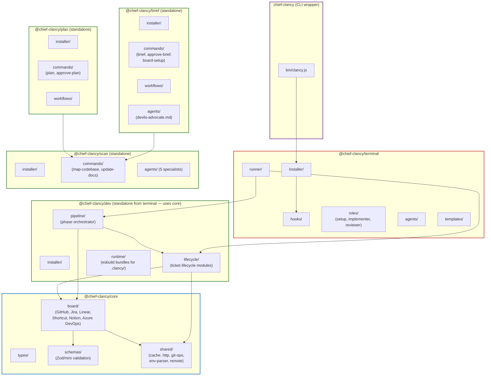

---

## 2. Role & Command Map

Every command organised by role. Core roles are always installed; optional roles opt-in via `CLANCY_ROLES`.

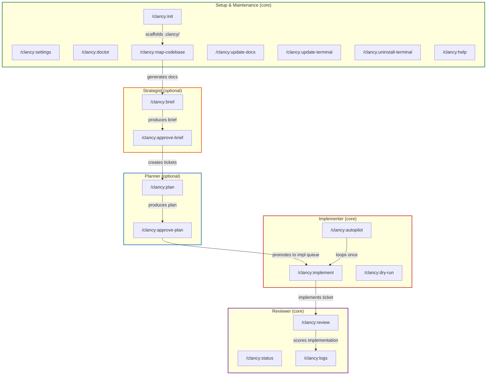

---

## 3. Lifecycle — End to End

A unit of work's complete journey from vague idea to merged code. Runs on two parallel paths — the **board path** (tickets move through the `clancy:brief → clancy:plan → clancy:build` label pipeline) or the **local path** (briefs and plans live as files in `.clancy/briefs/` and `.clancy/plans/`, with a `.approved` marker file gating implementation).

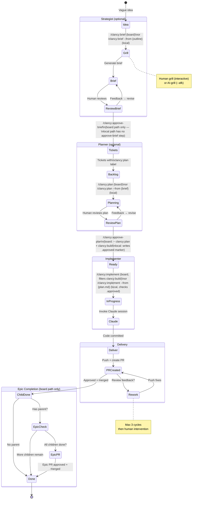

---

## 4. Implementation Flow

What happens inside `/clancy:implement` (and each iteration of `/clancy:autopilot`). Phase logic lives in `dev/src/pipeline/phases/`; Claude invocation lives in `terminal/runner/`.

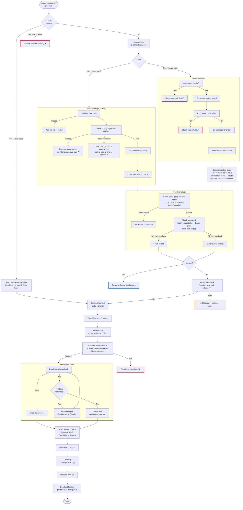

---

## 5. Strategist Flow — Brief to Tickets

The strategist's two commands: `/clancy:brief` (idea → brief) and `/clancy:approve-brief` (brief → board tickets).

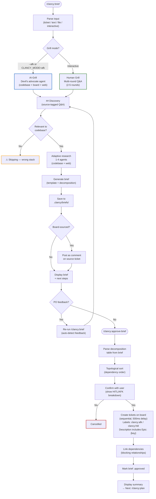

---

## 6. Board API Interaction Matrix

Which commands talk to which board APIs, and what operations they perform.

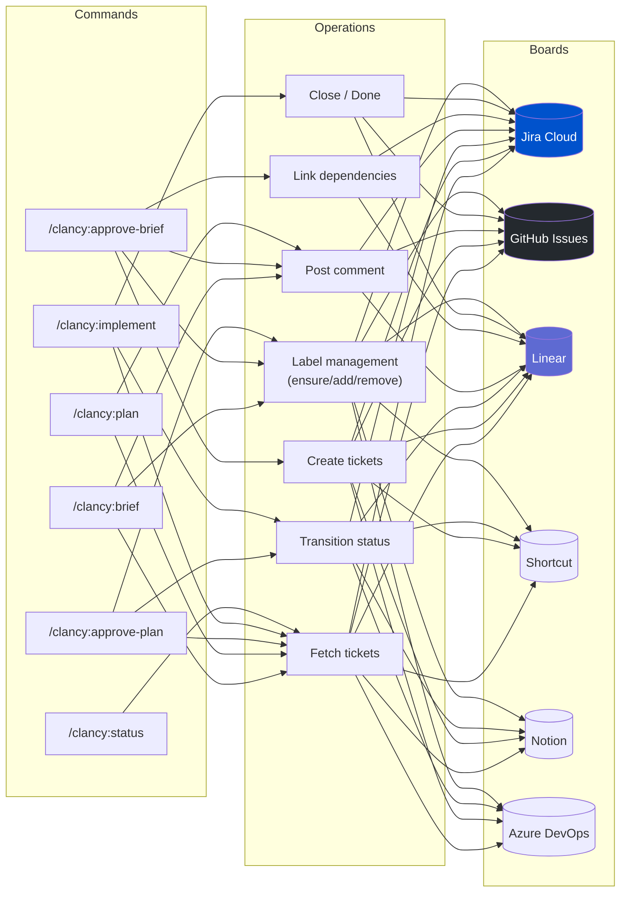

---

## 7. File Artifacts — What Lives in `.clancy/`

Everything Clancy creates and reads in the user's project.

```mermaid
graph TD
    subgraph ".clancy/"
        env[".env\n(optional board creds + config —\nabsent board markers = local mode)"]
        oncejs["clancy-implement.js\n(esbuild bundle)"]
        afkjs["clancy-autopilot.js\n(esbuild bundle)"]
        pkg["package.json\n({'type':'module'})"]
        progress["progress.txt\n(run log)"]
        costslog["costs.log\n(token cost estimates)"]
        lockfile["lock.json\n(crash recovery)"]
        sessionrpt["session-report.md\n(AFK summary)"]
        claudemd["CLAUDE.md\n(project instructions)"]

        subgraph "docs/"
            stack["STACK.md"]
            arch["ARCHITECTURE.md"]
            conv["CONVENTIONS.md"]
            test["TESTING.md"]
            dod["DEFINITION-OF-DONE.md"]
            design["DESIGN-SYSTEM.md"]
            a11y["ACCESSIBILITY.md"]
        end

        subgraph "briefs/"
            brief1["2026-03-18-dark-mode.md"]
            brief2["2026-03-17-auth-rework.md"]
            briefFb["...feedback.md\n(companion file)"]
        end

        subgraph "plans/"
            plan1["{plan-id}.md"]
            plan1a["{plan-id}.approved\n(SHA-256 + approved_at —\ngate for /clancy:implement --from)"]
            plan2["{plan-id}.md"]
            planFb["...feedback.md\n(companion file)"]
        end
    end

    init(["/clancy:init"]) -->|creates| env
    init -->|copies| oncejs
    init -->|copies| afkjs
    init -->|writes| pkg

    mapcb(["/clancy:map-codebase"]) -->|generates| stack
    mapcb -->|generates| arch
    mapcb -->|generates| conv
    mapcb -->|generates| test

    brief(["/clancy:brief\n(or --from <outline>)"]) -->|writes| brief1
    plan(["/clancy:plan\n(or --from <brief>)"]) -->|writes| plan1
    approveplan(["/clancy:approve-plan"]) -->|writes marker| plan1a

    once(["/clancy:implement\n(or --from <plan.md>)"]) -->|reads| env
    once -->|reads| stack
    once -->|"local path: reads + verifies"| plan1a
    once -->|appends| progress
    once -->|executes| oncejs

    logs(["/clancy:logs"]) -->|reads| progress

    style env stroke:#e65100,stroke-width:2px
    style progress stroke:#2e7d32,stroke-width:2px
    style oncejs stroke:#c62828,stroke-width:2px
    style afkjs stroke:#c62828,stroke-width:2px
    style plan1a stroke:#1565c0,stroke-width:2px
```

---

## 8. Delivery Paths — PR Flow with Epic Branches

All tickets are delivered via PR. The target branch depends on whether the ticket has a parent.

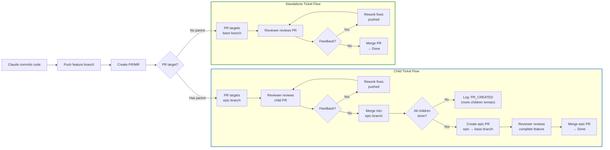

---

## 9. Prompt Building — What Claude Receives

The complete prompt structure for implementation and rework.

```mermaid
graph TD
    subgraph "Implementation Prompt"
        Header["You are implementing {ticket}"]
        Context["Ticket: key, title, description\nEpic/Parent | Blockers"]
        Exec["Step 0: Executability check\n(skip if not code work)"]
        TDD{"CLANCY_TDD\nenabled?"}
        TDD -->|Yes| TDDBlock["## TDD\nRed-green-refactor cycle"]
        TDD -->|No| Steps
        TDDBlock --> Steps
        Steps["1. Read .clancy/docs/\n2. Follow GIT.md\n3. Implement fully\n4. Commit\n5. Confirm done"]
    end

    subgraph "Rework Prompt"
        RHeader["You are fixing feedback on {ticket}"]
        RContext["Description + previous diff"]
        RFeedback["## Reviewer Feedback\n1. Issue A\n2. Issue B"]
        RTDD{"CLANCY_TDD?"}
        RTDD -->|Yes| RTDDBlock["## TDD"]
        RTDD -->|No| RSteps
        RTDDBlock --> RSteps
        RSteps["1. Read docs\n2. Follow GIT.md\n3. Fix feedback only\n4. Commit\n5. Confirm done"]
    end

    Header --> Context --> Exec --> TDD
    RHeader --> RContext --> RFeedback --> RTDD

    style TDDBlock stroke:#1565c0,stroke-width:2px
    style RTDDBlock stroke:#1565c0,stroke-width:2px
```

---

## 10. Planner Flow — Plan to Approval

The optional planning phase. Runs per-ticket after the strategist creates them.

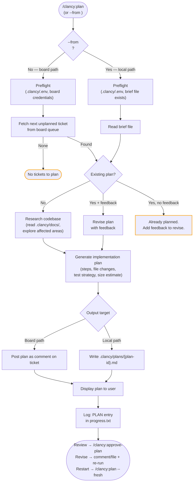

### Approve-plan flow

`/clancy:approve-plan` resolves its target in one of two shapes. When given a board ticket key it runs the board-transport flow (label swap, optional status transition). When given a plan-file stem (or path) it writes a sibling `.approved` marker file containing the SHA-256 of the plan file and an `approved_at` timestamp. That marker is the **gate** `/clancy:implement --from` checks before applying any plan.

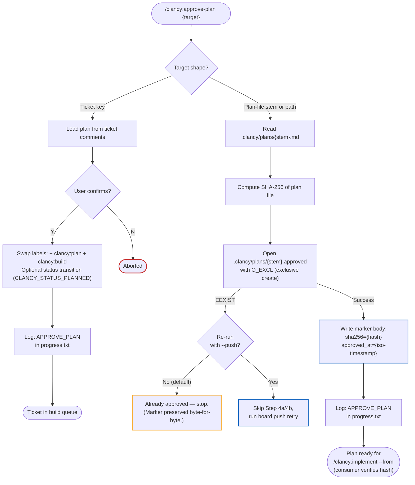

Hash comparison happens in the **consumer** (`/clancy:implement --from`), not in `/clancy:approve-plan`. Approve is write-once via `O_EXCL`; implement reads the marker, re-hashes the plan, and refuses to run on mismatch — the user must delete the marker and re-approve.

---

## 11. Hook Architecture — Events and Hooks

Which hooks fire on which Claude Code events, and what they do.

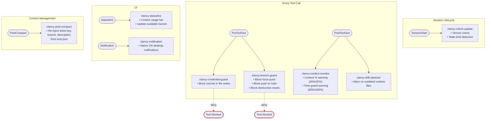

**Key rule:** All hooks are best-effort and fail-open. A crashing hook must never block the user's workflow.

---

## 12. Grill Phase — Human vs AI-Grill

The decision tree inside `/clancy:brief` Step 2a.

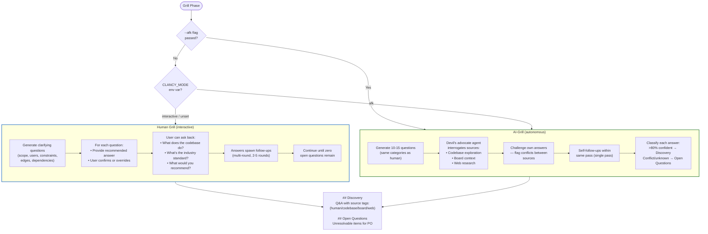

---

## 13. Build Pipeline

How packages are built and published.

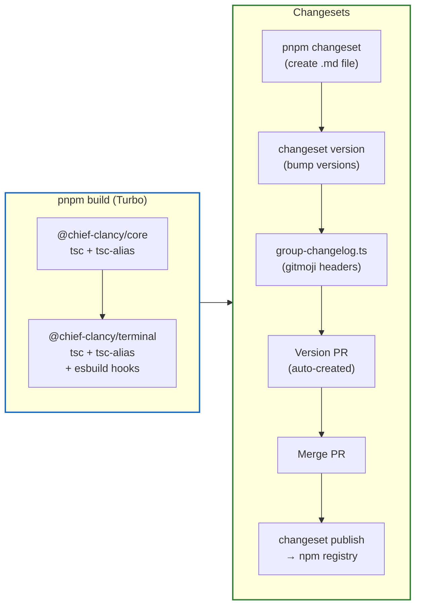
